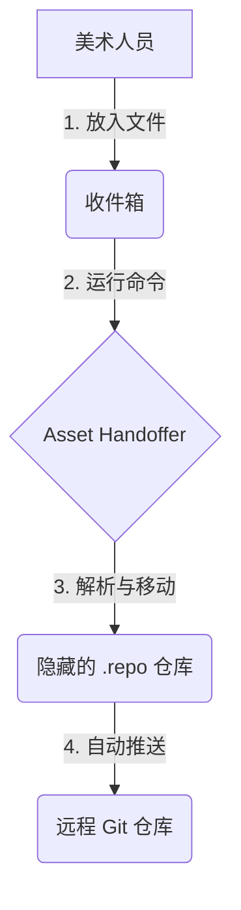

# Asset Handoffer

[](LICENSE)
[](pyproject.toml)
[](pyproject.toml)

放入即交付。

> **将复杂度外包给程序。**

## 为什么

| | 传统协作 | 使用 Asset Handoffer |
|:---|:---|:---|
| 美术需要 | 学习 Git、理解分支、解决冲突 | 放入文件，运行命令 |
| 程序需要 | 反复教学、帮忙解决问题 | 一次配置，无需干预 |
| 出错时 | 文件丢失、版本混乱 | 自动备份到失败目录 |



## 安装

```bash
pip install asset-handoffer
```

## 快速开始

```bash
# 程序：初始化配置
asset-handoffer init

# 美术：设置工作区
asset-handoffer setup config.yaml

# 美术：提交文件
asset-handoffer process config.yaml
```

## 配置

### 单规则（简单项目）

```yaml
naming:
  pattern: "^(?P<type>[^_]+)_(?P<name>[^_]+)\\.(?P<ext>\\w+)$"
  example: "Character_Hero.fbx"

path_template: "{type}/{name}.{ext}"
asset_root: "Assets/GameRes/"

git:
  repository: "https://github.com/team/game.git"
```

### 多规则（复杂项目）

支持多种命名规范，按顺序匹配：

```yaml
naming:
  rules:
    # 四层
    - pattern: "^(?P<category>[^_]+)_(?P<type>[^_]+)_(?P<name>[^_]+)_(?P<variant>[^_]+)\\.(?P<ext>\\w+)$"
      path_template: "{category}/{type}/{name}_{variant}.{ext}"
      example: "Character_Monster_Clicker_Idle.fbx"
    
    # 三层
    - pattern: "^(?P<category>[^_]+)_(?P<type>[^_]+)_(?P<name>[^_]+)\\.(?P<ext>\\w+)$"
      path_template: "{category}/{type}/{name}.{ext}"
      example: "Prop_Tool_Scanner.fbx"
    
    # 两层
    - pattern: "^(?P<category>[^_]+)_(?P<name>[^_]+)\\.(?P<ext>\\w+)$"
      path_template: "{category}/{name}.{ext}"
      example: "Audio_Ambient.wav"

asset_root: ""

git:
  repository: "https://github.com/team/game.git"
```

## 编程接口

```python
from asset_handoffer import Config, FileProcessor

config = Config.load("project.yaml")
processor = FileProcessor(config)
result = processor.process(Path("Character_Hero.fbx"))
```

## 命令

| 命令 | 说明 |
| :--- | :--- |
| `init` | 生成配置文件 |
| `setup` | 初始化工作区 |
| `process` | 处理并提交文件 |
| `status` | 查看待处理文件 |
| `delete` | 删除仓库中的文件 |

## 贡献

欢迎 Issue & PR。