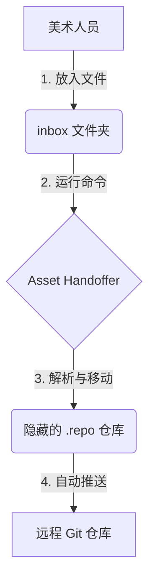

# Asset Handoffer

**美术资产交接自动化工具** - 让美术人员无需直接操作 Git 即可将资产提交到远程仓库。

[](LICENSE)
[](pyproject.toml)
[](pyproject.toml)

---

## 项目背景

在游戏开发过程中，美术资产的提交往往面临以下挑战：

| 传统方式 | 使用 Asset Handoffer |
| :--- | :--- |
| **学习成本**：美术人员需要学习 Git 命令或复杂的 GUI 工具 | **简化操作**：仅需拖放文件并运行单一命令 |
| **容易出错**：需要手动在复杂的 Unity 目录结构中定位 | **自动分发**：根据文件名正则表达式自动分发到正确目录 |
| **风险不可控**：容易发生误覆盖或合并冲突 | **风险隔离**：始终进行增量提交，冲突由程序统一处理 |
| **效率低下**：频繁中断程序员工作以协助解决环境问题 | **流程解耦**：美术专注创作，程序专注架构维护 |

**理念**：将资产提交过程中的决策权移交给自动化脚本，由配置规则定义文件流向。

## 工作原理



**处理流程**：
1. **Inbox**: 放置待提交文件（如 `Character_Hero.fbx`）到 `inbox/` 目录。
2. **Process**: 工具根据预设正则（如 `^(?P<type>\w+)_(?P<name>\w+)\.fbx`）解析文件名元数据。
3. **Move**: 将文件移动到映射路径（如 `.repo/Assets/GameRes/Character/Hero/Character_Hero.fbx`）。
4. **Push**: 执行 Git 提交并推送到远程分支。

## 安装

确保系统已安装 [Python 3.10+](https://www.python.org/)。

```bash
pip install asset-handoffer
```

## 快速开始

### 配置

作为程序，需要初始化项目配置并分发给美术。

1.  **初始化配置**
    ```bash
    mkdir my_asset_tool
    cd my_asset_tool
    asset-handoffer init
    ```
    *根据提示输入 Git 仓库 URL 和 Unity 资产根路径。*

2.  **配置 GitHub Token (推荐)**
    建议在生成的 YAML 配置文件中设置 `token`，以免去美术人员配置本地 Git 凭据的步骤。
    > 建议申请 GitHub Fine-grained Token，权限仅需 `Contents: Read and write`。

3.  **分发配置文件**
    将生成的 `config.yaml` 分发给美术团队。

### 使用

1.  **初始化工作区 (首次运行)**
    ```bash
    asset-handoffer setup config.yaml
    ```
    *此命令将初始化环境并创建 `inbox` 目录。*

2.  **提交资产**
    1. 将符合命名规范的文件（如 `Character_Hero.fbx`）放入 `inbox` 文件夹。
    2. 运行处理命令：
       ```bash
       asset-handoffer process config.yaml
       ```

## 配置说明

配置文件采用 YAML 格式，主要定义**命名规则**与**路径模板**的映射关系。

### 基础配置

```yaml
# 1. 命名解析规则 (基于 Python 正则表达式)
naming:
  # 使用 (?P<name>...) 语法定义捕获组
  pattern: "^(?P<type>[^_]+)_(?P<name>[^_]+)\\.(?P<ext>\\w+)$" 
  example: "Character_Hero.fbx"

# 2. 路径映射模板 (使用 {name} 引用捕获组)
path_template: "Assets/GameRes/{type}/{name}/"
asset_root: "Assets/GameRes/"

# 3. Git 仓库配置
git:
  repository: "https://github.com/team/game.git"
  commit_message: "Update {type}: {name}"
```

### 高级示例：按日期归档

支持任意复杂的正则组合。例如，按日期和作者归档：

```yaml
naming:
  pattern: "^(?P<date>\\d{8})_(?P<artist>\\w+)_(?P<desc>.+)\\.png$"
  example: "20231201_John_Sketch.png"

path_template: "Art/Sketches/{date}/{artist}/"
```

## 命令参考

| 命令 | 说明 | 示例 |
| :--- | :--- | :--- |
| `init` | 生成初始配置文件 (初始化用) | `asset-handoffer init -o config.yaml` |
| `setup` | 初始化本地工作区 (客户端用) | `asset-handoffer setup config.yaml` |
| `process` | 处理并提交文件 | `asset-handoffer process config.yaml` |
| `status` | 查看待处理文件列表 | `asset-handoffer status config.yaml` |
| `delete` | 删除仓库中的文件 | `asset-handoffer delete "Hero_*.fbx" config.yaml` |

## 常见问题

**Q: 使用此工具是否需要安装 Unity？**
A: 不需要。工具仅处理文件系统层面的移动和 Git 提交，不依赖 Unity Editor。

**Q: 如何处理文件冲突？**
A: 工具在提交前会自动执行 `git pull` 同步远程变动。如果遇到无法自动合并的冲突（如多人修改同一二进制文件），流程会中断并报错。此时需程序员介入 `.repo` 目录手动解决。

**Q: 命名不符合规范会怎样？**
A: `process` 命令会跳过不符合正则规则的文件，并输出错误提示。这些文件将保留在 `inbox` 中。

## 贡献

欢迎 Issue & Pull Request。

## License

MIT License