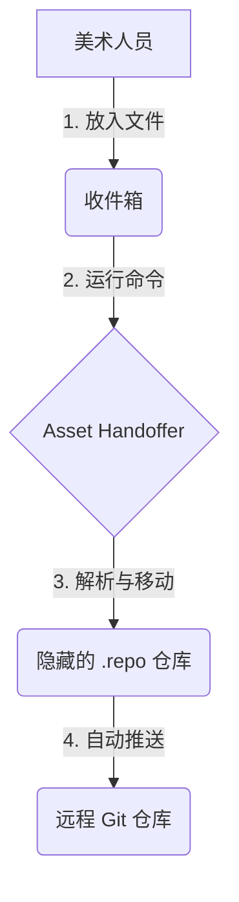

# Asset Handoffer

[](LICENSE)
[](pyproject.toml)
[](pyproject.toml)

放入即交付。

> **将复杂度外包给程序。**

## 为什么

| | 传统协作 | 使用 Asset Handoffer |
|:---|:---|:---|
| 美术需要 | 学习 Git、理解分支、解决冲突 | 放入文件，运行命令 |
| 程序需要 | 反复教学、帮忙解决问题 | 一次配置，无需干预 |
| 出错时 | 文件丢失、版本混乱 | 自动备份到失败目录 |



## 安装

### 美术人员（无需预装 Python）

双击 `scripts\install.bat`，自动安装 Python 环境和依赖。

### 开发者

需要 Python 3.10+ 和 Git。

```bash
pip install asset-handoffer
```

## 快速开始

### 程序员：初始化配置

```bash
asset-handoffer init
```

按提示输入 Git 仓库 URL 和资产根路径，生成配置文件。

### 美术：设置工作区

```bash
asset-handoffer setup project.yaml
```

克隆仓库并创建工作目录结构：

```
工作区/
├── inbox/      # 放入待处理的文件
│   └── handoff.bat  # 双击处理文件（自动生成）
├── .repo/      # 隐藏的 Git 仓库
└── failed/     # 处理失败的文件
```

### 美术：提交文件

1. 将文件放入 `inbox/` 文件夹
2. 双击 `inbox/handoff.bat`

或使用命令行：

```bash
asset-handoffer process project.yaml
```

自动预览处理结果，确认后执行：

```
同步中...

发现 3 个文件:
  Character_Hero.fbx -> Character/Hero.fbx
  Prop_Sword.fbx -> Prop/Sword.fbx (覆盖)
  Audio_BGM.wav -> [不匹配]

继续处理? [y/N]: y

[1/2] 处理：Character_Hero.fbx
成功：Character_Hero.fbx
   目标：Character/Hero.fbx
...
```

## 命令详解

### init

生成配置文件。

```bash
asset-handoffer init [OPTIONS]
```

| 参数 | 说明 |
|------|------|
| `--git-url` | Git 仓库 URL（交互式输入） |
| `--asset-root` | 资产根路径，默认 `Assets/GameRes/` |
| `--branch` | 分支名，默认 `main` |
| `--token` | Git Token，用于私有仓库（可选） |
| `--user-name` | 提交用户名（可选） |
| `--user-email` | 提交邮箱（可选） |
| `-o`, `--output` | 输出文件路径，默认为仓库名.yaml |

示例：

```bash
# 交互式（逐一询问所有设置）
asset-handoffer init

# 指定输出路径
asset-handoffer init -o config/my-project.yaml

# 非交互式（命令行指定所有参数）
asset-handoffer init --git-url https://github.com/team/game.git --asset-root Assets/ --branch main -o project.yaml
```

### setup

初始化工作区，克隆远程仓库。

```bash
asset-handoffer setup <CONFIG_FILE> [OPTIONS]
```

| 参数 | 说明 |
|------|------|
| `CONFIG_FILE` | 配置文件路径（必需） |
| `-y`, `--yes` | 跳过确认，适用于已存在仓库时自动重新克隆 |

示例：

```bash
# 首次设置
asset-handoffer setup project.yaml

# 强制重新克隆
asset-handoffer setup project.yaml -y
```

### process

处理收件箱中的文件并提交到 Git 仓库。

```bash
asset-handoffer process <CONFIG_FILE> [OPTIONS]
```

| 参数 | 说明 |
|------|------|
| `CONFIG_FILE` | 配置文件路径（必需） |
| `-f`, `--file` | 指定要处理的文件，可多次使用 |
| `-y`, `--yes` | 跳过确认，适用于 CI/CD |

执行流程：

1. 同步远程仓库（pull）
2. 解析文件名，计算目标路径
3. 检测覆盖冲突
4. 显示预览，等待确认
5. 移动文件，提交并推送

示例：

```bash
# 处理所有收件箱文件
asset-handoffer process project.yaml

# 处理指定文件
asset-handoffer process project.yaml -f inbox/Hero.fbx -f inbox/Sword.fbx

# 跳过确认（CI/CD）
asset-handoffer process project.yaml -y
```

### status

查看收件箱中待处理的文件。

```bash
asset-handoffer status <CONFIG_FILE>
```

输出示例：

```
收件箱：C:\Work\inbox

待处理文件 (2)：
  Character_Hero.fbx (12.3MB) -> Character/Hero.fbx
  Prop_Sword.fbx (5.7MB) -> Prop/Sword.fbx
```

### delete

从仓库中删除文件。

```bash
asset-handoffer delete <PATTERN> <CONFIG_FILE> [OPTIONS]
```

| 参数 | 说明 |
|------|------|
| `PATTERN` | 文件名匹配模式（glob 语法） |
| `CONFIG_FILE` | 配置文件路径（必需） |
| `-y`, `--yes` | 跳过确认 |

示例：

```bash
# 删除所有 fbx 文件
asset-handoffer delete "*.fbx" project.yaml

# 删除指定文件
asset-handoffer delete "Character/Hero.fbx" project.yaml -y
```

## 配置文件

### 完整示例

```yaml
# 工作区配置（可选）
workspace: "./"                    # 或详细配置：
# workspace:
#   root: "./"
#   inbox: "inbox"
#   repo: ".repo"
#   failed: "failed"

# Git 配置
git:
  repository: "https://github.com/team/game.git"  # 必需
  branch: "main"                                   # 默认 main
  token: ""                                        # 可选，用于私有仓库
  commit_message: "Update: {name}"                 # 提交消息模板
  user:
    name: "Asset Handoffer"
    email: "asset-handoffer@local"

# 资产路径
asset_root: "Assets/GameRes/"      # 仓库内的资产根目录

# 命名规则
naming:
  pattern: "^(?P<type>[^_]+)_(?P<name>[^_]+)\\.(?P<ext>\\w+)$"
  example: "Character_Hero.fbx"

# 或多规则
# naming:
#   rules:
#     - pattern: "..."
#       path_template: "..."
#       example: "..."

# 路径模板（单规则时需要）
path_template: "{type}/{name}.{ext}"

# 语言（可选，默认自动检测）
language: "zh-CN"                  # 或 en-US
```

### 命名规则说明

正则表达式必须包含 `ext` 命名组：

```yaml
# 正确
pattern: "^(?P<type>[^_]+)_(?P<name>[^_]+)\\.(?P<ext>\\w+)$"

# 错误：缺少 ext 组
pattern: "^(?P<type>[^_]+)_(?P<name>[^_]+)\\.(\\w+)$"
```

### Git 认证

**方式一：SSH**

```yaml
git:
  repository: "git@github.com:team/game.git"
```

**方式二：Token**

```yaml
git:
  repository: "https://github.com/team/game.git"
  token: "ghp_xxxxxxxxxxxx"
```

**方式三：环境变量**

```bash
export GIT_TOKEN=ghp_xxxxxxxxxxxx
# 或
export GITHUB_TOKEN=ghp_xxxxxxxxxxxx
```

## 编程接口

```python
from pathlib import Path
from asset_handoffer import (
    Config,
    parse_filename,
    compute_target_path,
    process_file,
    process_batch,
    GitRepo,
)

# 加载配置
config = Config.load(Path("project.yaml"))

# 解析文件名
parsed = parse_filename("Character_Hero.fbx", config.naming_rules)
if parsed:
    print(parsed["groups"])  # {'type': 'Character', 'name': 'Hero', 'ext': 'fbx'}

# 计算目标路径
target = compute_target_path(parsed, config.path_template, config.asset_root, config.repo)
print(target)  # .repo/Assets/GameRes/Character/Hero.fbx

# 处理单个文件
result = process_file(Path("inbox/Character_Hero.fbx"), config)
if result.success:
    print(f"成功: {result.target_path}")
else:
    print(f"失败: {result.message}")

# 批量处理
files = list(config.inbox.glob("*.fbx"))
success, failed = process_batch(files, config)
print(f"成功 {success}, 失败 {failed}")

# Git 操作
repo = GitRepo(config.repo, config.messages, config.git_token)
repo.pull()
repo.add(Path("..."))
repo.commit("message")
repo.push()
```

## 错误处理

### 文件名不匹配

文件被移动到 `failed/` 目录：

```
发现 3 个文件:
  Character_Hero.fbx -> Character/Hero.fbx
  InvalidName.fbx -> [不匹配]

[1/1] 处理：Character_Hero.fbx
成功：Character_Hero.fbx

成功：1
失败：1
失败的文件已移至：C:\Work\failed
```

解决：检查文件名是否符合配置的命名规则。

### Git 推送失败

文件会被移回 inbox 或移到 failed：

```
Git操作失败，文件已移回inbox：Push failed: ...
```

解决：检查网络连接、Git 凭据、仓库权限。

### 覆盖冲突

处理前会检测并提示：

```
发现 2 个文件:
  Character_Hero.fbx -> Character/Hero.fbx (覆盖)
  Prop_Sword.fbx -> Prop/Sword.fbx

1 个文件将覆盖远程，继续? [y/N]:
```

## 贡献

欢迎 Issue & PR。
